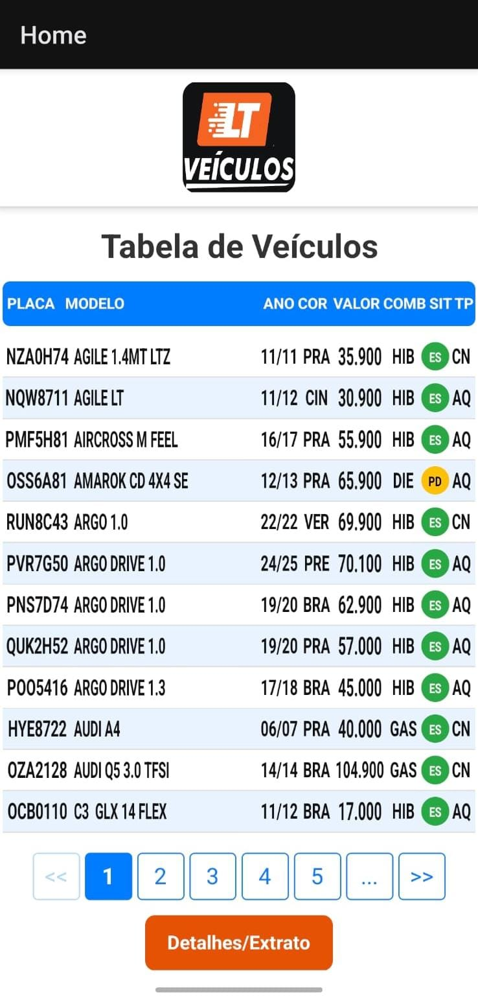

# 📱 AppFrontLT  

## 📖 Descrição  

O **AppFrontLT** é um **aplicativo mobile** desenvolvido em **React com Vite**, criado em parceria para apresentar uma proposta inovadora de padronização de tabelas aos clientes da **LT Veículos**.  
As letras maiores e mais espaçadas não são por falta de estilização, mas sim uma decisão de **usabilidade**: facilitar a leitura em tela única, já que os clientes não desejavam uma tabela com rolagem horizontal.  
Uma solução prática e funcional, construída como amostra para validar usabilidade, testar novas abordagens e colher feedbacks reais.  

---

## 🎮 Preview  

   

---

## 🔗 Repositórios Relacionados

- [Frontend (este repositório)](https://github.com/Matheus-TecDev/App-Frontend-TabelaLT.git)
- [Frontend (Site em Vite)](https://github.com/Matheus-TecDev/Site-Tabela-LT-Veiculos.git)
- [Backend (API)](https://github.com/Matheus-TecDev/LT-Veiculos-Backend.git)

---

## ⚡ Funcionalidades  

- Estrutura completa em **React com Vite** ⚛️⚡  
- Interface moderna, responsiva e intuitiva 🖥️  
- Aplicação funcional para demonstração a clientes 📋  
- Base sólida para futuras integrações e features 🚀  

---

## 📚 Tecnologias utilizadas  

- **JavaScript / TypeScript** 🔷

---

## 🚀 Como usar  

1. **Clonar o repositório**  

   ```bash
   git clone https://github.com/Matheus-TecDev/App-Frontend-TabelaLT.git
   
2. Entrar na pasta

	cd AppFrontLT
3. Instalar dependências

	npm install
	
4. Rodar em ambiente de desenvolvimento

	npx expo start
	
---	
	
## 👨‍💻 Autores

- [Matheus Freire](https://github.com/Matheus-TecDev)  
- [LinkedIn](https://www.linkedin.com/in/matheus-freire-martins-da-costa-318622376/) 
 
📫 Contato: matheus.tecnodev@gmail.com  

🤝 Projeto desenvolvido em parceria com a empresa DTI como amostra para **LT Veículos**.
